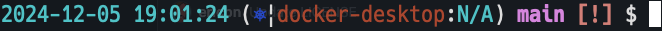

# chronoship
---

This is a Zsh prompt inspired by [asciiship](https://github.com/zimfw/asciiship)



## What does it display?
---
- Date and current time
    - The time is automatically updated every second as the prompt refreshes.
- Kubernetes information
    - Uses kube-ps1 to display Kubernetes details.
- Git information (if inside a Git repository)
  Requires the git-info module.
    - Displays the current branch name or a shortened hash in a ['detached HEAD' state].
    - Shows the current Git action in progress.
    - `$` when there are stashed states.
    - `!` when there are modified files.
    - `+` when there are staged files.
    - `>` and/or `<` when there are commits ahead and/or behind of remote, respectively.


## Requirements
The following modules are required:

- [zimfw/git-info] module
- [jonmosco/kube-ps1]

## Example Configuration

Add the following to your .zimrc:

```
zmodule jonmosco/kube-ps1
zmodule 0ta2/chronoship
```
